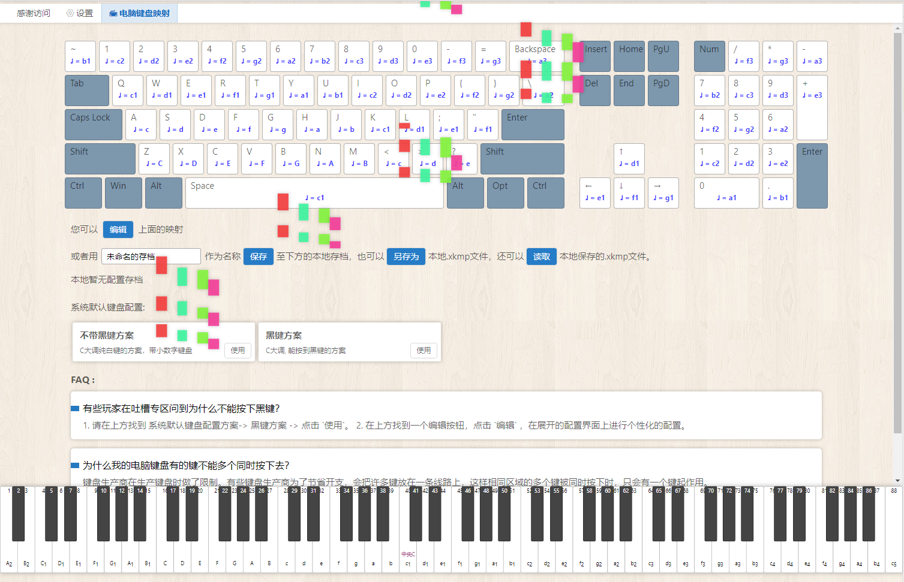

# 🎹 模拟钢琴 

一个功能丰富的在线钢琴模拟器，使用 Vue.js 构建。本项目不仅提供了基础的钢琴弹奏功能，还包含了多种练习和娱乐模式，致力于为用户提供一个有趣、易用的在线音乐学习和创作平台。



## ✨ 功能特性

*   **🎹 自由弹奏**：模拟真实的钢琴键盘，支持鼠标点击和电脑键盘两种操作方式，并可以自定义键盘映射。
*   **🎮 节奏游戏**：跟随下落的音符进行弹奏，在游戏中练习节奏感和反应速度。
*   **🎼 乐谱练习**：以瀑布流的形式可视化音符，方便用户跟谱练习。
*   **🎤 录音与回放**：随时记录您的弹奏，并支持回放和下载录音文件。
*   **🔌 MIDI 设备支持**：可以连接您的 MIDI 键盘等外设，获得更真实的弹奏体验。
*   **⚙️ 丰富设置**：提供音量调节、音色选择、键盘显示等多种自定义选项。

## 🚀 技术栈

*   **前端框架**: [Vue.js](https://cn.vuejs.org/) (v2)
*   **状态管理**: [Vuex](https://vuex.vuejs.org/zh/)
*   **路由**: [Vue Router](https://router.vuejs.org/zh/)
*   **样式**: Stylus
*   **构建工具**: Vue CLI

## 📦 安装与运行

1.  **克隆仓库**
    ```bash
    git clone https://github.com/your-username/webpage-piano.git
    ```

2.  **进入项目目录**
    ```bash
    cd webpage-piano
    ```

3.  **安装依赖**
    ```bash
    npm install
    ```

4.  **启动开发环境**
    ```bash
    npm run serve
    ```
    启动成功后，在浏览器中打开 `http://localhost:8080` 即可访问。

5.  **构建生产版本**
    ```bash
    npm run build
    ```

## 📄 开源协议

本项目基于 [MIT](LICENSE) 协议。
